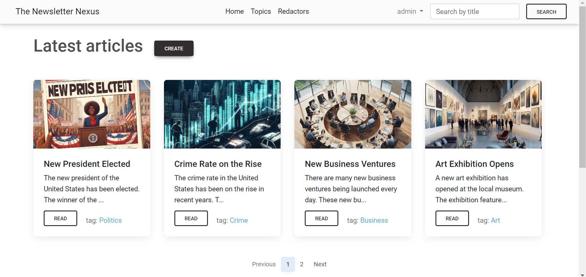

# Newspaper Agency Project

Django project for creating and reading newspapers.

## Check it out!

[Newspaper Agency Project deployed to Render](https://the-newspaper-nexus.onrender.com/)

Test User:
```
login: test_user
password: NeRQREDu6Bvs5Z
```

## Installation

```shell
git clone https://github.com/eduardhabryd/newspaper_agency.git
cd newspaper_agency
python3 -m venv venv
source venv\Scripts\activate
pip install -r requirements.txt
python manage.py makemigrations
python manage.py migrate
python manage.py loaddata test_data.json
python manage.py runserver
```

## Features

- Create a newspaper
- Read a newspaper
- Edit a newspaper
- Delete a newspaper
- Create publisher(register user)
- Edit publisher
- Every user can edit only his own newspaper
- Super user can edit all newspapersapers

## Demo

