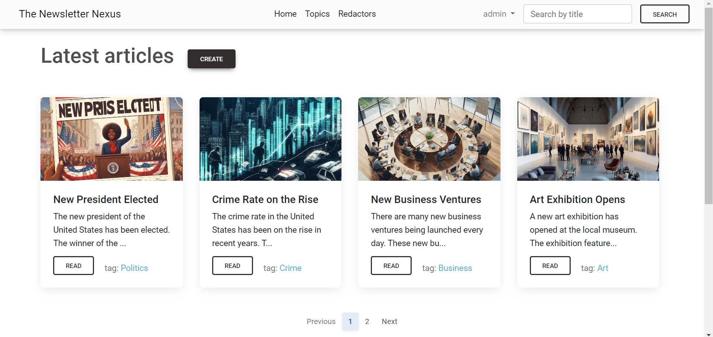

# 📰 Newspaper Agency Project

Welcome to the Newspaper Agency Project – a Django-based platform designed for creating and reading newspapers.

## Check it out!

Experience the Newspaper Agency Project in action by visiting our live deployment on [Render](https://the-newspaper-nexus.onrender.com/)

Test User:
```yml
👤 Login: test_user
🔑 Password: NeRQREDu6Bvs5Z
```

## 🛠️ Installation via GitHub

🪟 For Windows:
```shell
git clone https://github.com/eduardhabryd/newspaper_agency.git
cd newspaper_agency
python venv venv
venv\Scripts\activate
pip install -r requirements.txt
python manage.py makemigrations
python manage.py migrate
python manage.py loaddata test_data.json
python manage.py runserver
```
🍎 For Mac (and Linux):
```shell
git clone https://github.com/eduardhabryd/newspaper_agency.git
cd newspaper_agency
python3 -m venv venv
source venv/bin/activate
pip install -r requirements.txt
python manage.py makemigrations
python manage.py migrate
python manage.py loaddata test_data.json
python manage.py runserver
```

## 🚀 Features
Explore the powerful features of the Newspaper Agency Project:

- 📝 Create a newspaper
- 📖 Read a newspaper
- 📌 Edit a newspaper
- ❌ Delete a newspaper
- 👤 Create a publisher (register user)
- ✏️ Edit a publisher
- 📋 Every user can edit only their own newspaper
- 🔐 Superuser can edit all newspapers

## 📺 Demo
Take a sneak peek at our website interface:


